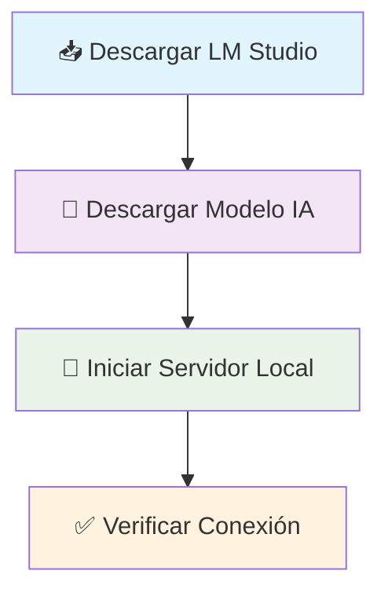

<div align="center">


# 🤖 Chat IA Local

*Una aplicación de chat moderna y elegante que se conecta a tu modelo de IA local*

[](https://reactjs.org/)
[](https://vitejs.dev/)
[](https://lmstudio.ai/)
[](https://pnpm.io/)

---

*Conecta, conversa y explora el poder de la IA local con una interfaz futurista y elegante*

</div>

## ✨ Características Principales

<table>
<tr>
<td align="center">

<br>
<strong>Interfaz Moderna</strong>
<br>
<em>Diseño futurista con gradientes y glassmorphism</em>
</td>
<td align="center">

<br>
<strong>Totalmente Responsive</strong>
<br>
<em>Perfecto en desktop, tablet y móvil</em>
</td>
<td align="center">

<br>
<strong>Chat en Tiempo Real</strong>
<br>
<em>Conversaciones fluidas y naturales</em>
</td>
</tr>
<tr>
<td align="center">

<br>
<strong>Historial Inteligente</strong>
<br>
<em>Mantiene el contexto de conversación</em>
</td>
<td align="center">

<br>
<strong>Indicadores Visuales</strong>
<br>
<em>Estados de carga y error elegantes</em>
</td>
<td align="center">

<br>
<strong>Accesible</strong>
<br>
<em>Diseño inclusivo y navegable</em>
</td>
</tr>
</table>

## 🛠️ Stack Tecnológico

<div align="center">

| Tecnología | Versión | Propósito |
|------------|---------|-----------|
|  **React** | 18.x | Framework de UI |
|  **Vite** | 5.x | Build tool ultra-rápido |
|  **CSS3** | - | Estilos modernos |
|  **LM Studio** | 0.3.16+ | Servidor de IA local |
|  **pnpm** | 8.x | Gestor de paquetes |

</div>

## 🚀 Inicio Rápido

### 📋 Requisitos Previos

> **⚠️ Importante**: Asegúrate de tener todo instalado antes de continuar

```bash
# Verifica las versiones
node --version    # ≥ 16.0.0
pnpm --version    # ≥ 8.0.0
```

<details>
<summary>💾 <strong>Instalación de Dependencias</strong></summary>

- [Node.js](https://nodejs.org/) v16+ 
- [pnpm](https://pnpm.io/): `npm install -g pnpm`
- [LM Studio](https://lmstudio.ai/) v0.3.16+

</details>

### 🔧 Configuración de LM Studio

<div align="center">



</div>

<table>
<tr>
<td>

**1️⃣ Configurar LM Studio**
```bash
# 1. Descargar LM Studio 0.3.16+
# 2. Instalar y abrir la aplicación
```

</td>
<td>

**2️⃣ Descargar Modelo**
```bash
# Modelos recomendados:
# • Gemma 3 12B
# • Llama 3.1 8B
# • Phi 3 Medium
```

</td>
</tr>
<tr>
<td>

**3️⃣ Iniciar Servidor**
```bash
# En LM Studio:
# Local Server → Seleccionar modelo → Start Server
# Servidor: http://localhost:1234
```

</td>
<td>

**4️⃣ Verificar API**
```bash
# Endpoint disponible:
# http://localhost:1234/api/v1/chat/completions
```

</td>
</tr>
</table>

### 🎯 Instalación del Proyecto

```bash
# 1️⃣ Clonar el repositorio
git clone [URL_DEL_REPOSITORIO]
cd chat-ia-local

# 2️⃣ Instalar dependencias
pnpm install

# 3️⃣ Ejecutar en desarrollo
pnpm dev

# 4️⃣ Abrir en el navegador
# 🌐 http://localhost:5173
```

<div align="center">

🎉 **¡Listo!** Tu chat IA local está funcionando

</div>

## 📁 Arquitectura del Proyecto

```
📦 chat-ia-local/
├── 📂 src/
│   ├── 🎨 App.jsx          # Componente principal del chat
│   ├── 💄 App.css          # Estilos principales
│   ├── 🌐 index.css        # Estilos globales
│   └── 🚀 main.jsx         # Punto de entrada
├── 📂 public/              # Archivos estáticos
├── 📄 package.json         # Configuración del proyecto
├── 📖 README.md           # Esta documentación
└── ⚙️ vite.config.js       # Configuración de Vite
```

## 🎨 Personalización Avanzada

### 🤖 Cambiar Modelo de IA

```javascript
// En App.jsx
const modeloIA = "gemma-3-12b-instruct"; // 👈 Cambia aquí
```

### 🎭 Personalizar Estilos

<details>
<summary>Ver opciones de personalización</summary>

```css
/* En App.css - Variables CSS personalizables */
:root {
  --primary-color: #6366f1;     /* Color principal */
  --secondary-color: #8b5cf6;   /* Color secundario */
  --accent-color: #06b6d4;      /* Color de acento */
  --background-dark: #0f172a;   /* Fondo oscuro */
  --glass-bg: rgba(255, 255, 255, 0.1); /* Efecto glass */
}
```

</details>

### ⚙️ Configurar Temperatura

```javascript
// Ajustar creatividad de la IA
const data = {
  "model": modeloIA,
  "messages": mensajesParaAPI,
  "temperature": 0.8,  // 0.1 (conservador) - 1.0 (creativo)
  "max_tokens": 1000   // Límite de tokens
};
```

## 🔧 Scripts Disponibles

<div align="center">

| Comando | Descripción | Uso |
|---------|-------------|-----|
| `pnpm dev` | 🚀 Desarrollo | Servidor local con hot-reload |
| `pnpm build` | 📦 Producción | Build optimizado |
| `pnpm preview` | 👀 Vista previa | Preview del build |
| `pnpm lint` | 🔍 Linting | Verificar código |

</div>

## 🐛 Solución de Problemas

<details>
<summary>🔌 <strong>Error de Conexión</strong></summary>

```bash
# Verificaciones:
✅ LM Studio está ejecutándose
✅ Servidor local activo (puerto 1234)
✅ Modelo cargado correctamente
✅ Firewall no bloquea el puerto
```

</details>

<details>
<summary>🤖 <strong>Modelo No Responde</strong></summary>

```bash
# Posibles soluciones:
✅ Verificar modelo cargado en LM Studio
✅ Confirmar nombre del modelo correcto
✅ Esperar a que el modelo se cargue completamente
✅ Reiniciar LM Studio si es necesario
```

</details>

<details>
<summary>⚡ <strong>Problemas de Rendimiento</strong></summary>

```bash
# Optimizaciones:
✅ Usar modelo más pequeño (< 8GB RAM)
✅ Ajustar configuración de LM Studio
✅ Reducir temperatura para respuestas más rápidas
✅ Cerrar otras aplicaciones pesadas
```

</details>

## 📊 Compatibilidad

<div align="center">

| Sistema Operativo | Navegador | Estado |
|-------------------|-----------|--------|
| 🪟 Windows 10/11 | Chrome 90+ | ✅ Compatible |
| 🍎 macOS 10.15+ | Safari 14+ | ✅ Compatible |
| 🐧 Linux Ubuntu | Firefox 88+ | ✅ Compatible |
| 📱 iOS 14+ | Safari Mobile | ✅ Compatible |
| 🤖 Android 8+ | Chrome Mobile | ✅ Compatible |

</div>

## 🤝 Contribuir

<div align="center">

**¡Contribuciones bienvenidas!** 🎉

</div>

```bash
# 1️⃣ Fork el proyecto
# 2️⃣ Crea tu rama de feature
git checkout -b feature/AmazingFeature

# 3️⃣ Commit tus cambios
git commit -m 'Add some AmazingFeature'

# 4️⃣ Push a la rama
git push origin feature/AmazingFeature

# 5️⃣ Abre un Pull Request
```

## 📄 Licencia

<div align="center">

Este proyecto está bajo la Licencia MIT - ve el archivo [LICENSE](LICENSE) para más detalles.

---

 **Si te gusta este proyecto, ¡dale una estrella!** ⭐

*Hecho con ❤️ y ☕ para la comunidad de desarrolladores*

</div>